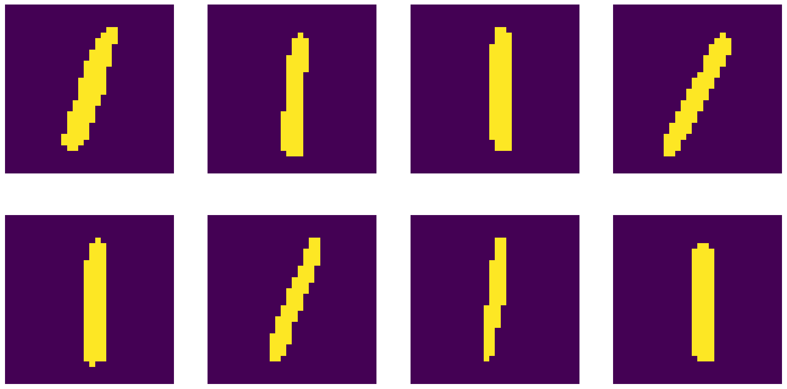
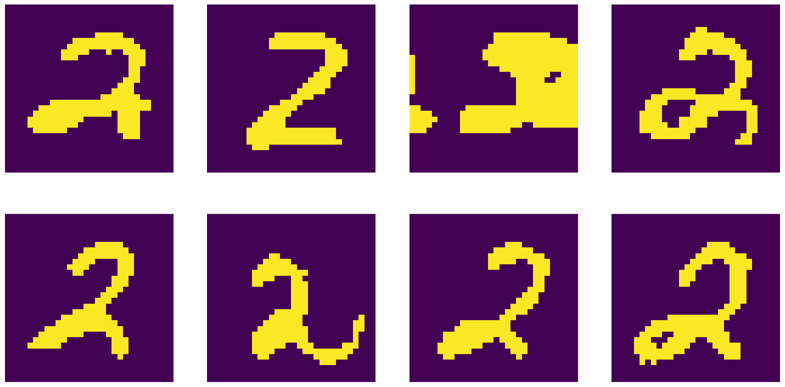
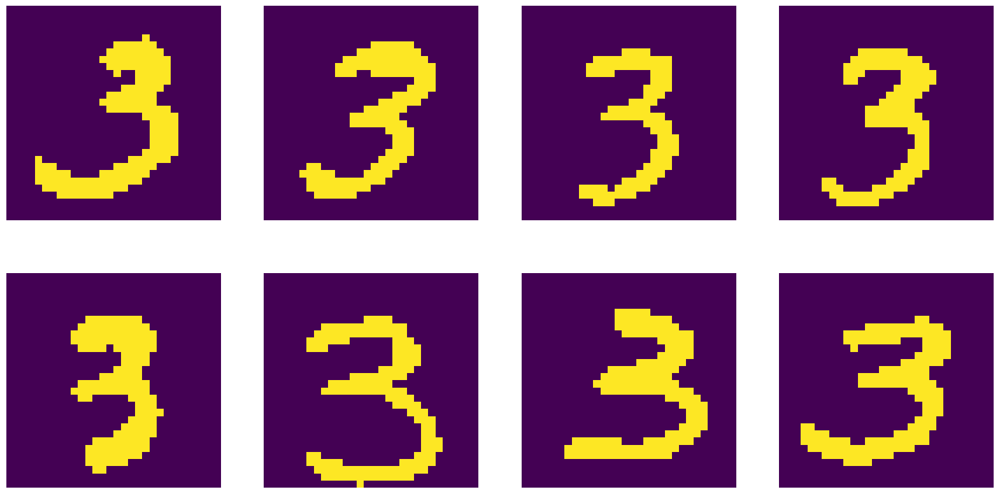
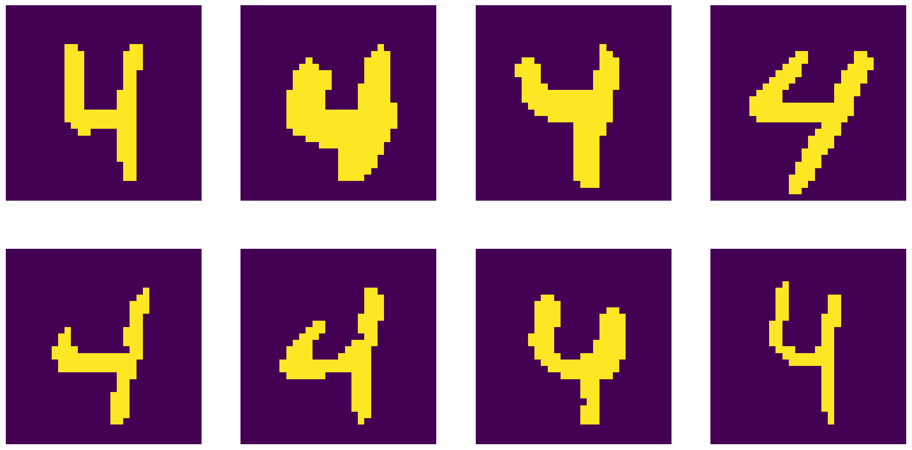
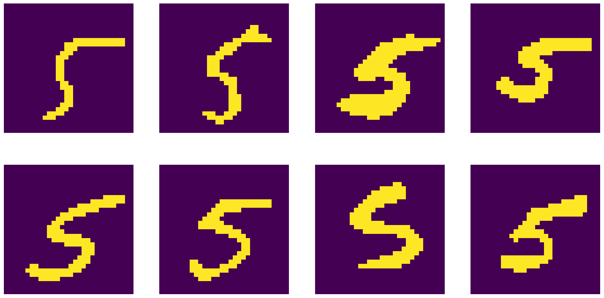
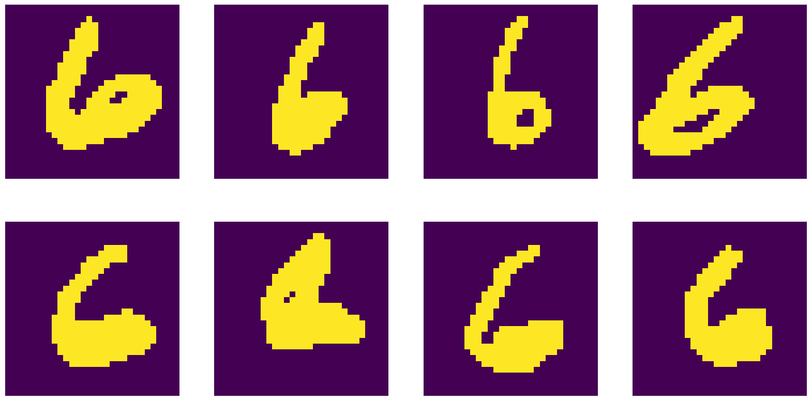
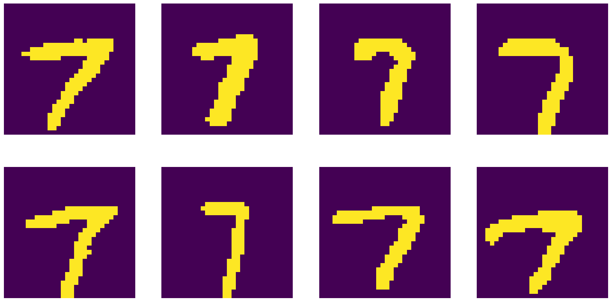
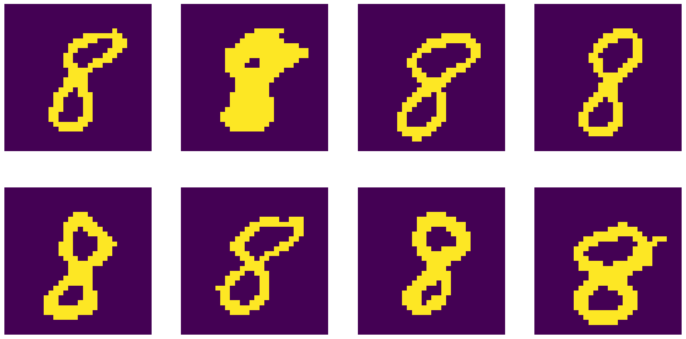
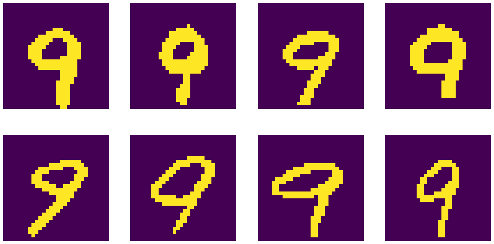

# MNIST Image Generation with Transformers

## Methodology

- MNIST images are transformed from 28x28 to 30x30
- the brightness values are mapped to {0, 1} (via torch.round)
- 6 bits form one symbol (2**6 = 64 symbols for pixels), starting from ASCII value 58 (:)
- start token is the class we want to generate (what we condition on)
- end token is )

Textual representation:

5::::::::::::::::::::::::::::=Z::IyZ:Ayy::AyZ::AwZ:::r::::j::::r::::R::::H::::AZ:::=j::::r::::v::::r:::Ar:::Yj::;y:::=v:::Yj::;yZ::;v::::::::::::::::::)

0:::::::::::::::::::::::j:::=r:::Ar:::Iv:::Yx:::yp::;w`::;rA::=jA::A:A::H:A::H:A::V:A::V:@::V:H::R:R::R;j::V=j::Yy:::Yv:::Ir:::=Z::::::::::::::::::::::)

4:::::::::::::::::::::::::::::::::=::::=:;::<:=::@:=::@:=::H:=::H:=::F:=::v:=:Yv:=yvR:;x:R::::R::::r::::r::::r::::r::::r::::r::::R::::R::::::::::::::::)

## Training

| Transformer Hyperparameters | Value |
|-----------------------------|-------|
| d_model                     | 256   |
| n_heads                     | 8     |
| n_layers                    | 8     |
| context_size                | 152   |
| p_dropout                   | 0.1   |

- trained on 10k MNIST images (their text representations)
- learning rate = 1e-4
- Adam optimizer
- batch size = 128
- epochs = 1 (training takes approx. 40 minutes on an RTX3060)

## Results

| Hyperparameters for Sampling  |          Details          |
|-------------------------------|---------------------------|
| Sequence Generation           | 64 sequences at the same time |
| Transformer Temperature       | 0.8                        |
| Classifier                    | CNN trained on MNIST      |
| Classifier Logits Temperature | 0.8                        |
| Output Selection              | Best 8 sequences shown    |

- Inference time (64 generations): approx. 3s (on an RTX3060)

